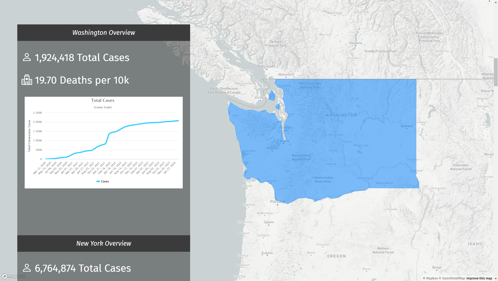
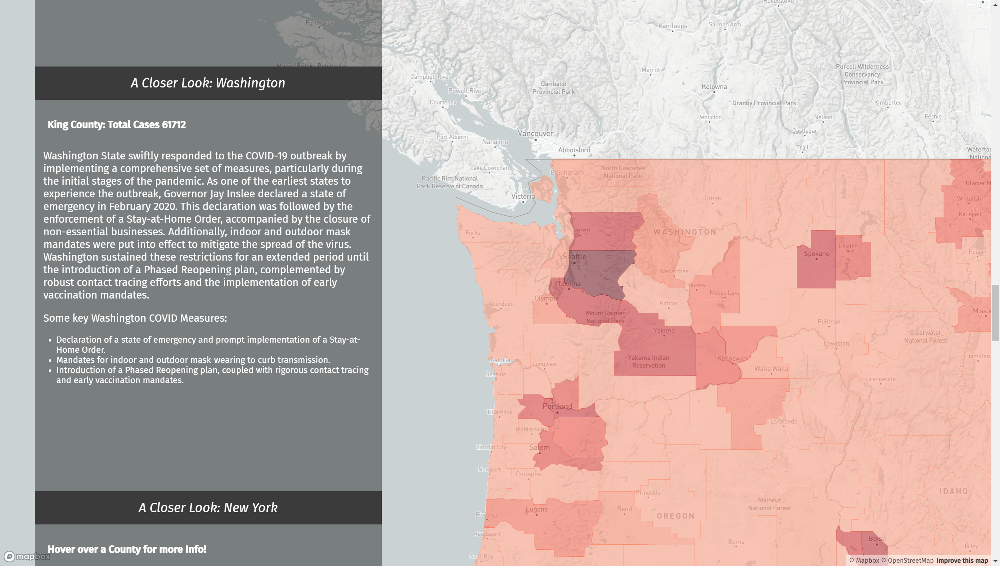

# GEOG 458 Final Project: COVID-19 Mapping in the U.S.

Reginald R Asplet, Carter Dainel Burr, Caden Ty Henson, Yanyi Li

Winter 2024, Group AB4

[Link to the live map](https://aspletr.github.io/458_final_project/)

## Project Description

Our final project is to make a Map-based storytelling application of COVID cases across the United States. This map is intended to help the user understand the impact that COVID-19 has had across different regions of the United States, helping visualize how the pandemic swept across the country. This map also intends to examine the policies  that were in place as well as the precautions that were taken in each of these states, showing how they might have impacted the Covid trends in that state.

## Screenshots

## Project Goals

This digital platform will serve as a tool for public health officials, healthcare providers, and the general public to track the most recent COVID-19 trends, track the spread of the disease, and make informed decisions that can better help the public and hospitals. Examination of how the policies play a role in Covid trends based across the country will also help officials form future plans if an outbreak occurs in the future. Officials will be able to see what policies are the most effective to reduce the spread, as well as the policies that proved to be less effective.  The most important function of our project is leveraging geographic data and storytelling techniques to highlight spatial relationships and create a deeper understanding of the impact of COVID-19. To do this we will need to implement various features into our storytelling map, such as pictures and videos and a series of maps to tell our story. The maps can dive into different states and regions across the US and show how certain areas were more impacted than others.

## Data Sources

- [New York Times COVID-19 Data](https://github.com/nytimes/covid-19-data)

## Applied Libraries

- [Mapbox GL JS](https://docs.mapbox.com/mapbox-gl-js/api/)
- [Bootstrap Icons](https://icons.getbootstrap.com/)
- [scroolama](https://github.com/russellsamora/scrollama)

## Acknowledgements

We would like to thank the New York Times for providing the COVID-19 data that we used in our project. We would also like to thank Professor Bo Zhao, and TA Liz Peng for their help and support throughout the quarter.
